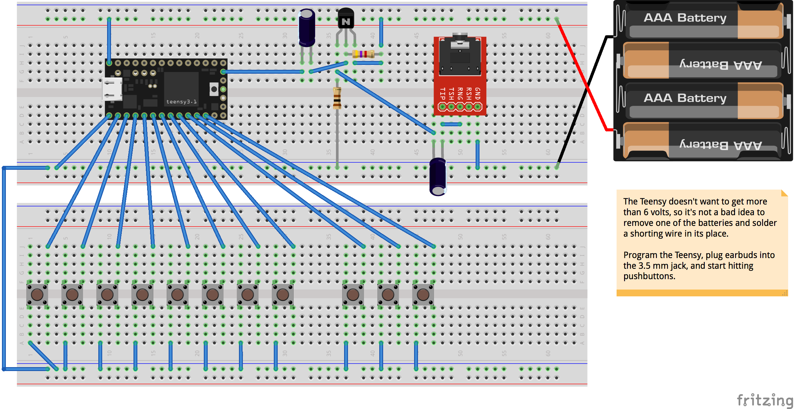

<!--
pip install markdown
python -m markdown README.md > README.html
-->

Modular Music Synthesis in C++
====

Docs available [here](http://wware.github.io/Synth.cpp/).

Historical background
----

Way back when, one of my friends in high school was a guy named [Dave Wilson](http://www.matrixsynth.com/2010/08/rip-david-hillel-wilson-curator-of-new.html) whose father got him into 1970s-era Moog-style analog electronic music synthesizers. Dave created a museum of historical synthesizers in his home in Nashua, New Hampshire. Throughout our high school and college years, we exchanged ideas and circuits and bits of lore for various synthesizer hacks.

Music synthesizers of that era were composed of [modules](https://en.wikipedia.org/wiki/Modular_synthesizer) and were actually special-purpose [analog computers](https://en.wikipedia.org/wiki/Analog_computer), performing arithmetic operations with [integrators, summers, and other such circuits](https://courses.engr.illinois.edu/ece486/labs/lab1/analog_computer_manual.pdf). These computations can be performed digitally by a microprocessor or special-purpose digital circuit (e.g. FPGA). So Dave and I both at various points and in various contexts wrote code to do that.

Sound generation in this code is done in C++, and can run on the [Teensy 3.1 board](https://www.pjrc.com/teensy/teensy31.html) which has a 32-bit ARM microcontroller capable of running at 96 MHz.

Embodiments
----

This code has two readily available embodiments. One is the test.py script which will generate an audio file called "quux.aiff" and play the file.

The other is an easy-to-build piece of electronics using a Teensy board, some batteries, some pushbuttons, a few components, and a pair of earbuds. I call this thing a "trivisynth" because it is the most trivial piece of hardware that one could justifiably call a synthesizer.

Performance considerations
----

The ARM core on the Teensy does not have floating-point hardware, so the most frequently performed calculations should be done with [fixed-point arithmetic](https://en.wikipedia.org/wiki/Fixed-point_arithmetic). On integer machines, divide operations are also slow, so alwyas prefer a right-shift whenever possible.

An interrupt handler is used to transfer audio samples from a queue to the DAC. This should be done as quickly as possible.

If the arithmetic is too slow, the queue will underrun because the frequency of the timer interrupt is fixed. This is indicated by the LED turning on. If you see the LED, your options are to reduce the sampling rate or reduce the number of voices.

At some point I will take some time to thoroughly profile pieces of the code, particularly the Filter::step() method, and see where things should be more thoroughly optimized. The Teensy processor's instruction set includes a nice multiply-accumulate that intrigues me.

Structure of the code
----

The synthesis modules are defined in `teensy/synth.h` and `teensy/synth.cpp`. The voices that you can play are defined in `teensy/voice.h`. The code that uses these things to produce music is `teensy/teensy.ino` when running on the Teensy, and `test.cpp` when running on your laptop or desktop.

When you want to start tinkering, the place to start is `voice.h`, where you can combine the modules in different ways to get different sounds. If you design a new instrument, you'll want to modify `teensy.ino` for your keyboard layout.

test.py
====

This script works on both OS X and Ubuntu. It generates an audio file and plays it.

trivisynth
====

I've posted this as a project on [Frizing.org](http://fritzing.org/projects/trivisynth#).

You'll need [Teensyduino](https://www.pjrc.com/teensy/teensyduino.html) set up in order to load the code onto your Teensy board. Install the Arduino IDE and the Teensyduino add-on on your laptop or desktop, and load the `teensy/teensy.ino` file. You should also see `synth.h`, `synth.cpp`, and `voice.h` as additional tabs in the IDE. Use the checkmark button in the upper left to verify the code is syntactically correct and compile it, and the arrow button to load the code into your Teensy.

You might want to first build it on a solderless breadboard and solder it down later. To get started, supply power to the Teensy and build the audio output circuit, and then

Teensy 3.1 info
----

* [The Freescale Semiconductor web page](http://www.freescale.com/webapp/sps/site/prod_summary.jsp?code=K20_50) for the MK20DX256VLH7 processor used in the Teensy 3.1.
* [The datasheet](https://www.pjrc.com/teensy/K20P64M72SF1RM.pdf) talks about GPIO programming starting on page 1331.
* [Here](https://www.pjrc.com/teensy/schematic.html) is the Teensy 3.1 schematic.
* [Here](https://forum.pjrc.com/threads/25317-Assembly-coding-for-Teensy3-1) is a great discussion of embedding assembly in C code. Also see [this](http://www.ethernut.de/en/documents/arm-inline-asm.html).
* [A C header file](http://www.keil.com/dd/docs/arm/freescale/kinetis/mk20d7.h) for registers in the MK20DX.
* [Some nice info](http://www.peter-cockerell.net/aalp/html/frames.html) on ARM assembly language.
* There is an [online ARM C++ compiler](http://assembly.ynh.io/).
